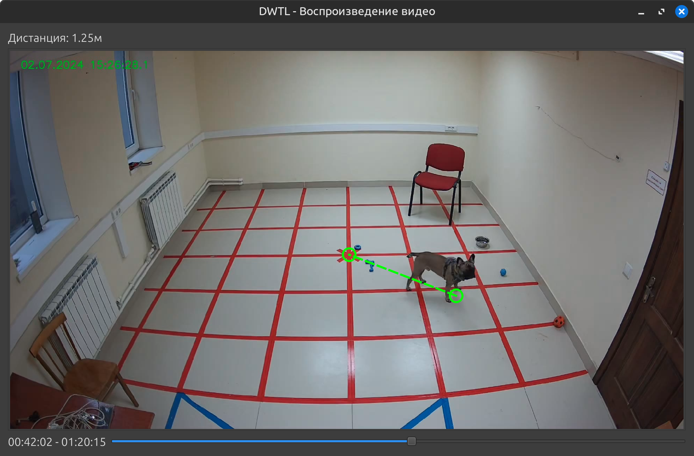

# DogsWantToLive - расчет расстояния на видео

## Описание проекта

Приложение на Python с использованием PyQt6 и OpenCV, предназначенное для измерения расстояния между двумя точками на видео с учетом перспективных искажений.

## Возможности

- Открытие видеофайлов (`.mp4`).
- Выбор двух точек на кадре для измерения расстояния.
- Коррекция перспективы с использованием гомографической трансформации.
- Управление воспроизведением видео:
  - `Пробел` — пауза/воспроизведение.
  - `D` — перемотка вперед на 1 минуту.
  - `A` — перемотка назад на 1 минуту.
  - `Escape` — закрытие видео.
- Отображение измеренного расстояния на экране.

## Установка и запуск

### Требования

- Python 3.8+
- `pip` (Python package manager)

### Установка зависимостей

Перед запуском убедитесь, что у вас установлены все необходимые библиотеки. Вы можете установить их с помощью команды:

```sh
pip install -r requirements.txt
```

### Запуск программы

Запустите приложение с помощью команды:

```sh
python main.py
```

## Использование

1. Откройте видеофайл, нажав кнопку "Открыть видео".
2. Выберите две точки на кадре для измерения расстояния.
3. Программа скорректирует перспективу и отобразит расстояние между точками в реальном масштабе.
4. Используйте горячие клавиши для управления воспроизведением.

## Изображение окна программы


